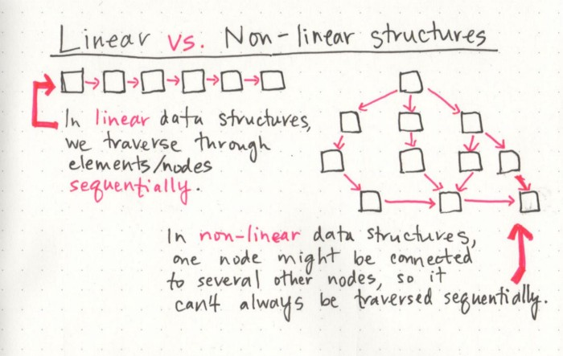

# Linked Lists

## What is a Linked List

- a Linked List is sequence of node that connect to each other like an array of
- there are two type : singly and doubly.

## Terminology

1. linked list contain nodes that point to the next node .
2. singly mean its point to one reference which is the next node .
3. doubly mean its point to two next  references and previous .
4. node its the item\links(data) that live in the node .
5. next its property exist in the node .
6. head its reference to the first node .
7. Current  its the node that we looking into it .

## Traversal

- we cant use any loop we use the next property.
- the best way to travel its while loop .
- first we must look to the head then loop.

## Adding a Node

1. Adding O(1)

- first we connect new node with the head and make its point ot the previous head then we disconnect the head on previous node .

2. Adding a Node O(n)

- first we create the new node then we move to the O(n) node we want to add  we make the previous node point to the new node and make he new node point to the next node .

## data structures

- they are two type of data structure : Linear data structures and non-Linear data structures

## Memory management

- the big different between array and linked list its the way whey use machine memory

## when we should use linked list

- we should use linked list when we don't know what is  size is the list and we want to add or remove to it quickly .
